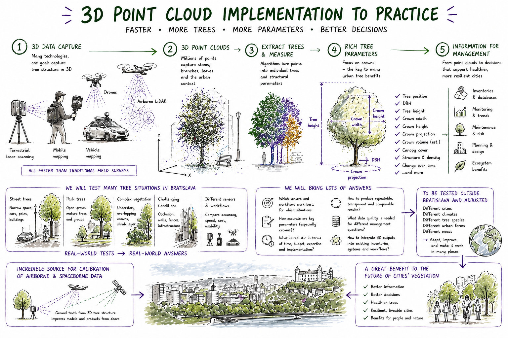
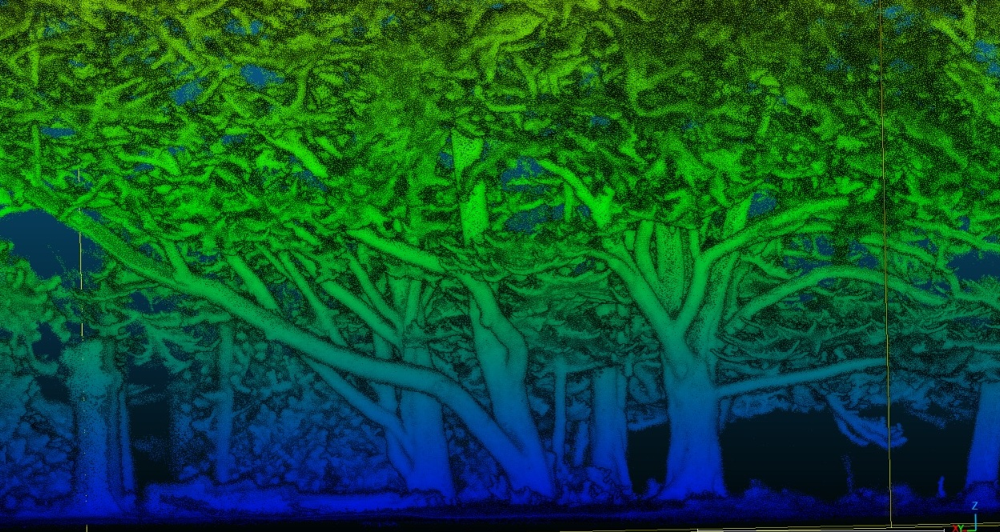
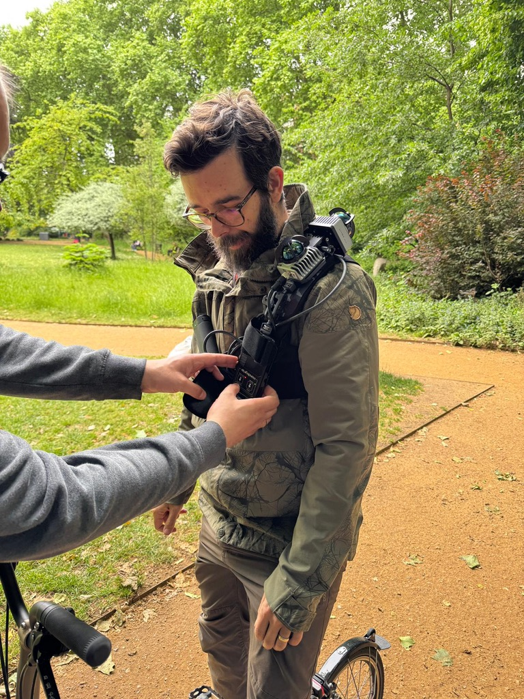

---
hide:
  - navigation
  - toc
---

  

    
Bratislava, 1–5 June 2026

    <h1 class="home-title">3D Urban Tree Intelligence</h1>
    

      A hands-on international hackathon and implementation testbed for turning 3D point clouds into practical information for urban tree management.
    

    

      In Bratislava, we will test LiDAR sensors, mobile mapping systems, low-cost prototypes, and processing workflows in real city conditions.
    

    

      <a href="https://forms.gle/JojaUStXvXsKozBw6" target="_blank" rel="noopener" class="primary-cta">Sign up for the newsletter</a>

      

        <a href="en/for-managers/" class="secondary">I manage urban trees</a>
        <a href="en/hardware/" class="secondary">I provide scanning technology</a>
        <a href="en/processing/" class="secondary">I process 3D tree data</a>
      

    

  

The Bratislava Hackathon

<h1>Testing 3D tree monitoring in a real city</h1>

Urban trees are essential living infrastructure. They shape shade, cooling, biodiversity, carbon storage, public space, stormwater regulation, and the quality of everyday urban life.

To manage and monitor them well, we need to understand not only where trees are, but also their three-dimensional structure: stems, crowns, height, crown spread, growth form, and how these properties change over time.

New 3D sensing technologies are making this increasingly practical. Terrestrial laser scanning, handheld and backpack mobile mapping, vehicle-based systems, drones, airborne LiDAR, and new low-cost prototypes can now collect detailed tree-structure data much faster than before.

The Bratislava hackathon will bring together researchers, practitioners, hardware providers, software developers, and urban-tree stakeholders to test how these technologies can support real-world urban vegetation management.

From point clouds to practice

<h2>How 3D tree data can become practical city intelligence</h2>

The hackathon will test the full chain: capturing 3D data, creating point clouds, extracting individual trees, measuring richer tree parameters, and translating the results into information that can support inventories, monitoring, planning, and future implementation pilots.

  

    
What will happen?

    <h2>A one-week implementation testbed</h2>
    

      From 1–5 June 2026, participants will work in Bratislava to scan selected urban tree sites, process point clouds, compare workflows, and define practical outputs for urban tree monitoring.
    

    

      This is not only a conference and not only a data-collection campaign. It is a coordinated experiment: sensors, processing methods, data standards, field protocols, and management questions will be tested together.
    

    

      The goal is to understand which combinations of hardware and software are fit-for-purpose for tree detection, tree catalogues, DBH, height, crown parameters, uncertainty reporting, and repeatable monitoring.
    

  

  

    
  

What we test

<h2>Sensors, workflows, and practical outputs</h2>

  

    
    

      <h3>3D sensing systems</h3>
      
Static TLS, handheld mobile laser scanning, backpack systems, vehicle-based mapping, drone-derived point clouds, airborne LiDAR, and low-cost prototypes.

    

  

  

    
    

      <h3>Processing workflows</h3>
      
Tree extraction, individual tree detection, catalogue creation, DBH, height, crown metrics, QSM, biomass-related structure, uncertainty, and reproducibility.

    

  

  

    
    

      <h3>Management relevance</h3>
      
Which outputs are useful for city tree inventories, crown assessment, monitoring, planning, maintenance prioritisation, and future implementation pilots?

    

  

  <h2>Do you manage urban trees?</h2>
  

    If you are a city, municipality, public authority, utility company, park manager, arboricultural team, urban forestry unit, or vegetation manager, we would like to hear from you.
  

  

    We are especially interested in real management questions: which tree parameters matter, which measurements are difficult to collect today, what outputs would be useful, and how 3D monitoring could support future city workflows.
  

  

    If you manage urban trees anywhere in the world and want to explore whether these solutions could be tested in your city or organisation, please get in touch.
  

  
<strong>Contact:</strong> Dr. Martin Mokros, UCL, m.mokros@ucl.ac.uk

  

    
  

  

    
Why Bratislava?

    <h2>A real urban landscape for testing</h2>
    

      Bratislava provides a real city context for testing 3D urban-tree monitoring. The hackathon will work with heterogeneous urban sites, including street trees, park trees, tree clusters, trees near buildings, trees with shrubs or understory, and locations with direct municipal relevance.
    

    

      The local setup includes municipal tree data, airborne LiDAR campaigns, drone surveys, RTK support, ground-control measurements, and engagement with people responsible for urban vegetation management.
    

    

      This makes Bratislava a strong place to test not only whether a sensor can produce a point cloud, but whether the resulting data can become useful tree-level information.
    

  

For companies and technology providers

<h2>Bring your system into a real urban-tree testbed</h2>

We welcome engagement from companies, sensor developers, mapping teams, and technology providers working with LiDAR, mobile mapping, robotics, drones, SLAM, point-cloud processing, tree analytics, or urban vegetation intelligence.

The Bratislava hackathon is an opportunity to test systems under realistic urban conditions, understand what tree managers actually need, compare operational constraints, and contribute to an emerging practical pipeline for 3D urban tree monitoring.

We are particularly interested in systems that can help collect or process data faster, reduce field burden, improve repeatability, support tree-level catalogues, or make 3D structure accessible to non-specialist urban-vegetation teams.

  

    <h3>Hardware providers</h3>
    
Bring or propose terrestrial, mobile, backpack, vehicle, drone, or prototype sensing systems for realistic urban-tree testing.

  

  

    <h3>Software teams</h3>
    
Contribute workflows for segmentation, tree detection, DBH, height, crown metrics, catalogues, QSM, biomass, or uncertainty reporting.

  

  

    <h3>Implementation partners</h3>
    
Help translate point clouds into practical outputs for inventories, monitoring, planning, and future pilot deployments.

  

Follow the project

<h2>Sign up for the newsletter</h2>

Receive updates from the Bratislava testbed, including field and office video tutorials, protocols, benchmark outputs, data-related information, publications, and future opportunities to test the workflows in other cities.

  <a href="https://forms.gle/JojaUStXvXsKozBw6" target="_blank" rel="noopener">Sign up for the newsletter</a>

Expected outputs

<h2>Built for practical reuse</h2>

  

    <strong>Benchmark tables</strong>
    Sensor and workflow comparison.
  

  

    <strong>Open protocols</strong>
    Field, ingest, metadata, and QA.
  

  

    <strong>Tree-level outputs</strong>
    Detection, catalogues, DBH, height, and crown parameters.
  

  

    <strong>Policy brief</strong>
    Guidance for municipalities.
  

  

    <strong>Training materials</strong>
    Videos, figures, and workflow docs.
  

  

    <strong>Publications</strong>
    Dataset and synthesis papers.
  

